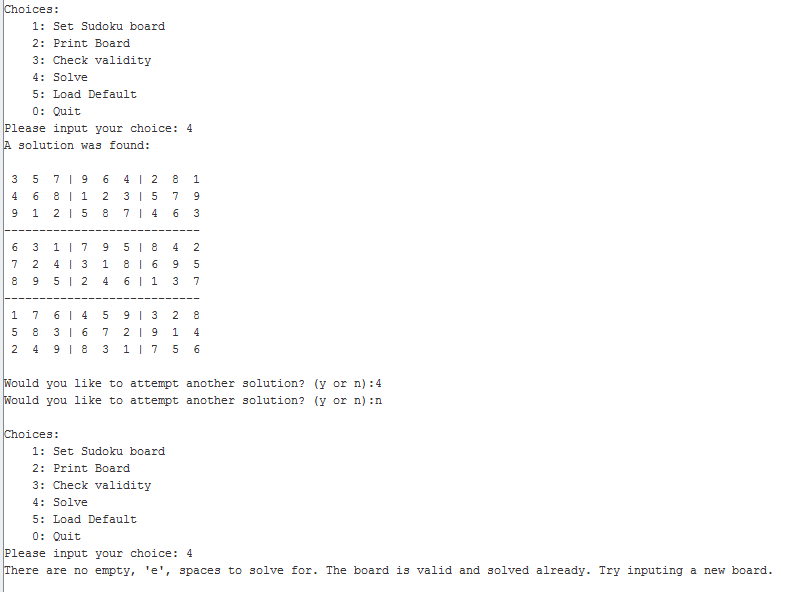
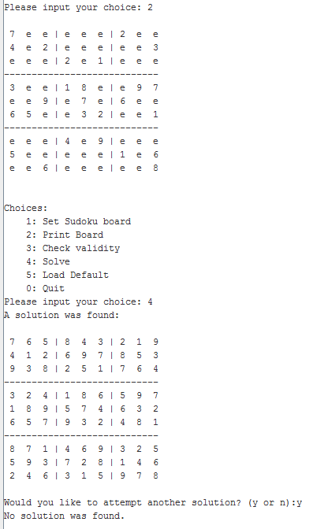
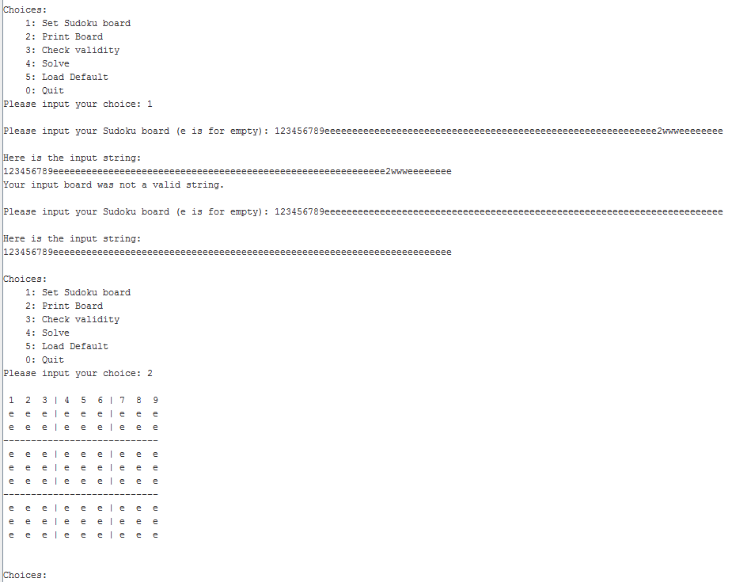
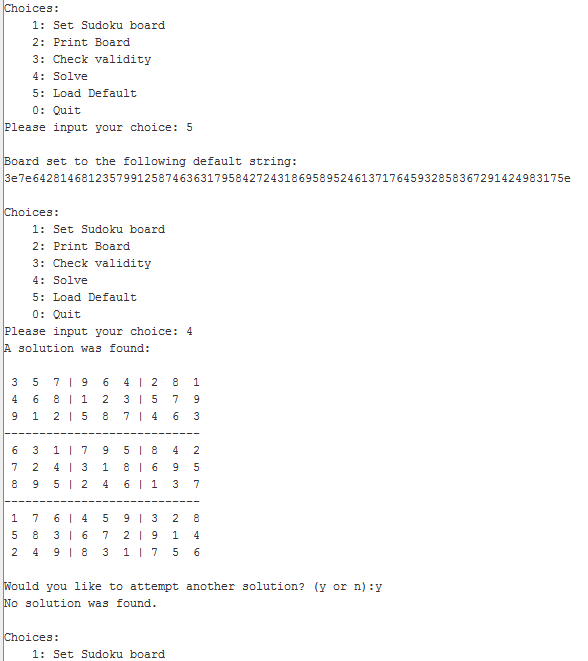
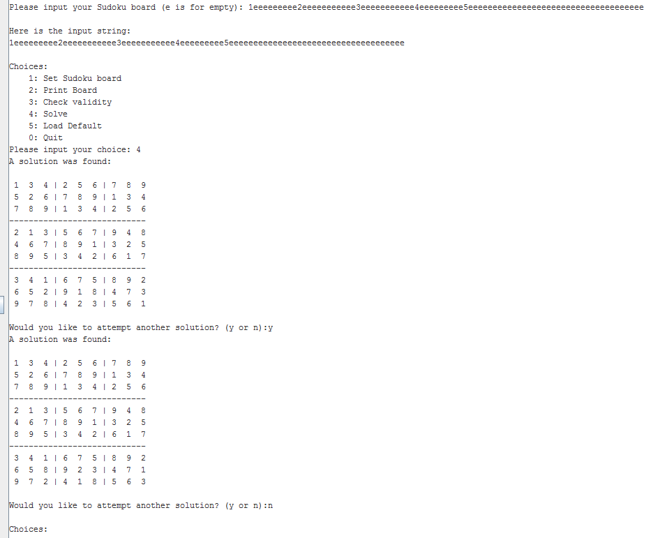
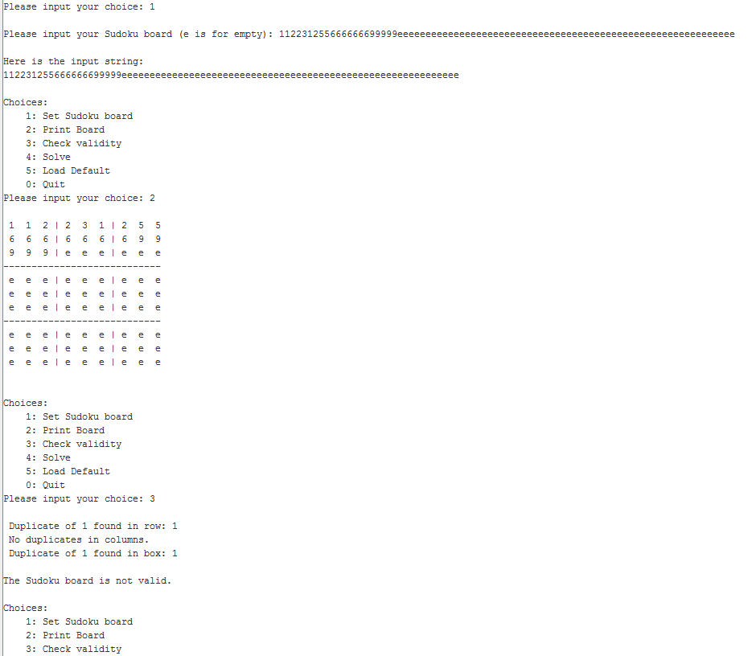
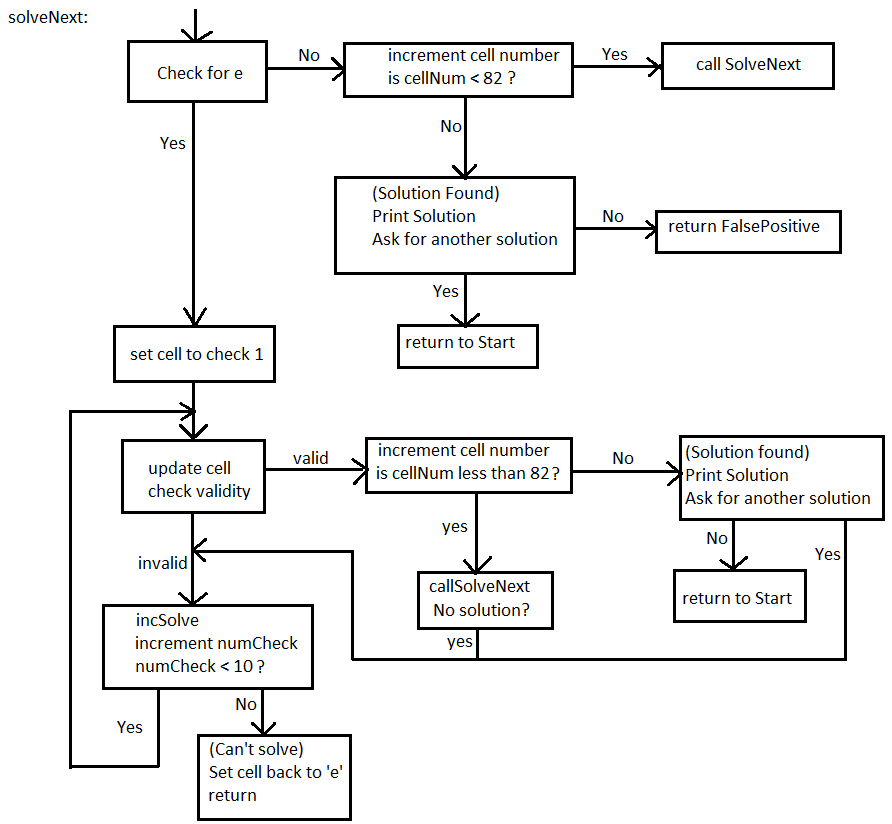

William Stawicki  

Sudoku

**Program Features:**

The program starts with a menu with the options to set or input a Sudoku board, print the sudoku board, check the validity of the Sudoku board, solve the Sudoku board, and load a default Sudoku board that is hard coded into the program.   

The Sudoku solver is able to take in a string of characters from the user and store the string for analysis as a Sudoku board. The string that the user inputs is checked to make sure it only has characters 1 through 9 and e. The ‘e’ is used as a placeholder for an empty cell in the Sudoku board. If the user inputs an invalid string, then the user is asked to input a new string until an acceptable string is input.   

Once the user has input their string, then they are returned to the options menu where they can print the board that was input. The board is printed with separators sectioning off boxes 1-9 to make reading the Sudoku board easier. Empty spaces in the Sudoku board appear as ‘e’. 

After setting the board, the user can check its validity. The program will check each row, column, and box to make sure there are no duplicate numbers. The program will display the first occurrence of a duplicate in a row, column, and box. If no duplicates are found, then the program will state that the Sudoku board is valid. Otherwise, the board is invalid.  

The user can then try to solve the board that was input. If the board is invalid, the program will let the user know that the input board is invalid and will not attempt to solve the board. If the input board is valid, then the program will check to make sure there is at least one empty cell to solve for. If there is no empty cell to solve for, the program will let the user know that the board is valid and solved already. If there is one or more cells to solve for then the program will find a solution if possible. If a solution is found, then the solution is displayed. The user then has the option to attempt to find another solution or to stop and return to the main menu.  

Each part of the program seems to work correctly. The program takes input boards, displays boards, and solves boards without error, or at least without error during testing. 

There is an extra feature of being able to load a default board that is built into the program so that testing could be done more easily. There is also the ability to solve for extra solutions to a given board. The board can have any number of empty cells and the solver will find one or more solutions if possible. Generally the more missing cells, or ‘e’ ‘s, then the longer it will take to solve the board.   

For this project, the development process went a lot smoother due to the use of a stack. Being able to store and retrieve variables allowed for more flexible code writing and less micromanagement of what functions were using what variables. Using the stack also allowed for the ability to implement recursion effectively. Recursion ended up being essential to solving the Sudoku problem.   

This program is recursive in nature in how it solves the Sudoku board. I took the design approach of developing specific functions for different tasks. For instance, one function checks the validity of the rows, another the validity of the columns, and one for the validity of the boxes. By boxes, I mean the three by three subsections of the nine by nine board. Another function is responsible for printing out the board. Then once I had thoroughly tested each function and made sure each worked correctly. I combined them into, or called them from, an overall recursive function that would be used to solve the Sudoku board.   

Dividing the task of solving the Sudoku board into smaller tasks assisted in error checking. As I made each function, I caught most of the bugs that each function was causing early on. Thus, later when I was working on the overall recursive function, “SolveNext”, I was able to narrow in on only a small set of issues that were easily identifiable based on the error symptoms I got. 

One error, was that I was only looping between 1 and 8 instead of 1 and 9 inside the loop of SolveNext. This caused the program to only be able to solve for a number between 1 and 8 in an empty cell. Then when the missing number to the solution was a 9, the program would think that there was no solution. I simply increased the upper bound of the loop to 9 instead of 8 and the error was corrected.  Many of the errors I ran into were loop bounds related like the last bug I just mentioned in detail.  

In solving the bugs, I used a lot of test printing. So when a function would be executed, it would print out a number or string to see what the program was doing as I tweaked it. Adding the “Load Default” board function also came in handy when testing so I did not have to keep retyping in the same board over and over again.

**I/O demonstrations:**

Example of trying to solve an already solved board:   

Example of printing and solving a board: 

Attempting to input a board and print it:  

Setting default board and solving for the three blank cells, also an attempt to find another solution:  

Finding multiple solutions to a single board:

Checking validity of a board:  

**Implementation Details:** 

The code is split into several main sections. The first list of: Start, Set, Check, LoadDefault, and Solve are sections of code that interact as the major framework of how the program flows. The Start section just prints out a menu and then jumps to either Set, Check, LoadDefault, or Solve depending on the user’s input. These sections of code do not have parameters or return values. These sections contain related code for doing individual overall tasks like getting input. These overall sections of code call more formal functions. 

**Overall sections:**  
    
    Start- displays menu  
    Set- sets the board using user’s input  
    Check- checks the board for validity  
    LoadDefault- loads the hardcoded default array  
    Solve- initiates the recursive SolveNext function

The following procedures are used throughout the program.  

**Procedures:**

    Print- Prints the Sudoku board  
        Interface:   
            # board  a string of characters  
            No return values  

    checkBoardR- Checks the rows for duplicates  
        Interface:  
            No parameters  
            # $s0 	return error found 0 no 1 yes  
            # $s1   return (row box or column) number (1-9)  
            # $s2   return r row, c column, b box  
            # $s3   return error generating number ascii character  
    checkBoardC- Checks the columns for duplicates  
        Interface:  
            # board  a string of characters  
            # $s0 	return error found 0 no 1 yes  
            # $s1   return (row box or column) number (1-9)  
            # $s2   return r row, c column, b box  
            # $s3   return error generating number ascii character  
    checkBoardB- Checks the box subsections for duplicates  
        Interface:  
            # board  a string of characters  
            # $s0 	return error found 0 no 1 yes  
            # $s1   return (row box or column) number (1-9)  
            # $s2   return r row, c column, b box  
            # $s3   return error generating number ascii character  
    SolveNext- A recursive function for solving the Sudoku board  
        Interface:  
            # board  a string of characters  
            # $t1	input: number of array  
            No Return Value (Although the act of returning means the function did not find a solution to the cell)

The Sudoku board is stored under the label as ‘board’ as a .space type with 82 bytes reserved. The validity of the board is checked using the three functions checkBoardR, checkBoardC, and checkBoardB. The functions check for duplicate numbers in the rows, columns, and boxes. If a duplicate is found by either of those functions, the function returns a 1 in $s0, row/cell/box number 1-9 in $s1, indication of a row, column, or box in $s2, and the number 1-9 that caused the error in $s3. If no duplicate is found then the function returns a 0 in $s0, and ‘n’ in $s1, and an ‘n’ in $s3.   

During the test phases of developing the program and the individual functions, I placed a lot of “debugging output” throughout the code. Mainly to print strings, such as the board, or temporary variables for error diagnosis.   

As far as how I implemented the solving of the Sudoku puzzle, I did a lot of planning before writing any code. I first started with figuring out how I would check the validity of input string. This gave rise to the plans for the three functions; checkBoardR, checkBoardC, and checkBoardB. I then basically outlined in a flow chart what would have to happen to solve the Sudoku recursively using the validity functions checkBoardR, checkBoardC, and checkBoardB. That gave rise to the Solve and SolveNext functions. The Solve procedure would basically initialize and seed the recursive action of the SolveNext function. The SolveNext function is designed to work its way through the Sudoku board one cell at a time and try solutions for 1-9 for each cell. If no solution is found by SolveNext, it returns to its caller which is either a SolveNext caller or a Solve caller. If a solution is found, then SolveNext calls the Print function to print the solution. If another solution is desired, the SolveNext function returns to the caller basically causing a false positive and the caller continues searching for another solution. This recursive nature allows for this program to solve a Sudoku with any amount of empty cells. 

The following is a flow chart of the SolveNext recursive function used as a plan to help code the recursive function:

